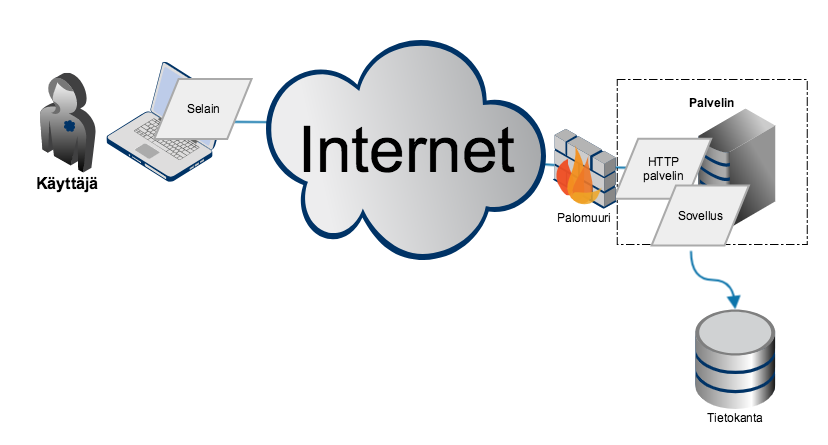
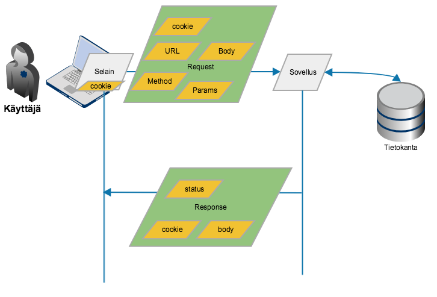
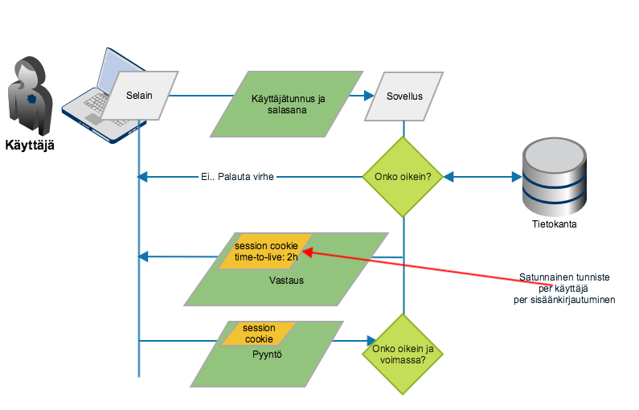
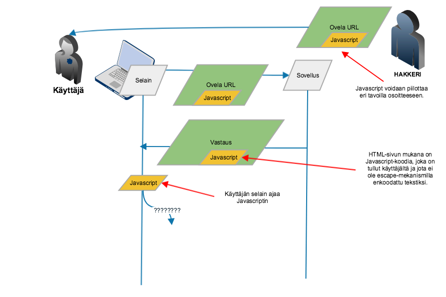

# Perusasioita web-sovelluksen tietoturvasta

# HTTP-pohjaisen verkkosovelluksen peruskuva

* Softaa pyörittävä serveri ei ole suoraan näkyvissä käyttäjälle tai hakkerille. Välissä on palomuuri. (Ohitetaan nyt tilanne jossa palomuurin asetukset ovat väärin.)
* Palomuuri päästää läpi (oikean näköiset) HTTP-pyynnöt, ei muuta.
* Hyökkäys ja hakkerointi tapahtuu tavalla tai toisella sovelluksen kautta. Hakkerilla ei ole mitään suoraa reittiä käyttäjään.



# HTTP-protokolla lyhyesti

* Käyttäjän selain lähettää pyynnön, jonka sovellus (HTTP-palvelin) käsittelee ja palauttaa vastauksen.
* Pyynnön voi lähettää joko Javascript-ohjelma, joka pyörii selaimessa, selain itse tai käyttäjän toimenpide (hiiren klikkaus tai muu toimenpide) voi aiheuttaa pyynnön lähettämisen.
* Yhtä aikaa voi olla useita pyyntöjä käsittelyssä.
* Pyyntö ja vastaus sisältävät useita erilaisia elementtejä.



## HTTP-protokollan request/response elementit suppeasti

* *URL* on pyynnön kohde-osoite, joka koostuu useammasta tietoelementistä. scheme:[//[user[:password]@]host[:port]][/path][?query][#fragment]
Esimerkiksi: http://www.solita.fi/
* *Method* kuvaa pyynnön tarkoitusta ja määrittää sen rakennetta ja käsittelyä. GET, POST, PUT, DEL, TRACE, HEAD, OPT.
* *GET* ei saa muuttaa järjestelmän tilaa (tai ei saisi). 
* *POST* (tai PUT) on tarkoitettu tilan muutoksiin. POST-pyynnön mukana voidaan lähettää monimutkaisia ja isoja datasisältöjä body-elementissä.
* *cookie* on osa header-osiota. Cookie on tieto, jonka selain tallettaa ja yhdistää URL-osoitteeseen ja jonka selain lähettää takaisin sovellukselle automaattisesti pyynnön yhteydessä.

## Esimerkki HTTP-pyynnöstä ja vastauksesta

Esimerkki pyynnöstä. Selain lähettää muutakin kuin osoiterivillä näkyvän osoitteen.

```
GET /1234/login?uid=hakkerson&pw=hakkerson HTTP/1.1
Host: google-gruyere.appspot.com
accept-encoding: gzip, deflate, br
accept-language: en-US,en;q=0.8,fi;q=0.6
user-agent: Mozilla/5.0 (Macintosh; Intel Mac OS X 10_10_5) AppleWebKit/537.36 (KHTML, like Gecko) Chrome/60.0.3112.113 Safari/537.36
accept: text/html,application/xhtml+xml,application/xml;q=0.9,image/webp,image/apng,*/*;q=0.8
cookie: GRUYERE=4053|hakkerson||author; GRUYERE_ID=12345
```
 
Esimerkki vastauksesta. Body-osuudessa tulee HTML-koodia, jonka selain esittää käyttäjälle ja joka muodostaa käyttäjälle näkyvän sivun ulkoasun selaimessa.

```
HTTP/1.1 200 OK
Cache-Control: no-cache
Content-type: text/html
Pragma: no-cache
Set-Cookie: GRUYERE=4053|hakkerson||author; path=/1234
X-XSS-Protection: 0
Content-Encoding: gzip
X-Cloud-Trace-Context: 9578109ccfaaf688aca8577022fdae71;o=1
Vary: Accept-Encoding
Date: Mon, 11 Sep 2017 10:41:16 GMT
Server: Google Frontend
Expires: Mon, 11 Sep 2017 10:41:16 GMT
 
 
<!DOCTYPE HTML PUBLIC "-//IETF//DTD htm//EN//3.0"><HTML>
<HEAD>
<TITLE>Welcome to the Awesome App!</TITLE>
</HEAD>
<BODY BACKGROUND="background1.gif" LINK=#FF0000 ALINK=#FF0000 VLINK=#FF0000>
<SCRIPT LANGUAGE="JavaScript">
<!-- Hide the code
browserName = navigator.appName;
-->
Lai lai
</BODY>
```

## HTML, hyvin lyhyt oppimäärä

* ```<tag>``` avaa markup-elementin, </tag> sulkee elementin. jos "tag" viittaa johonkin mitä selain ei tunnista, tyypillisesti selain ohittaa sen kokonaan.
* Eli ```<``` ja ```>``` ovat erikoismerkkejä, jotka eivät voi esiintyä tekstissä sellaisenaan.
* ```<script>``` tagin avulla voidaan esitellä Javascript-koodia (tai muita skriptikieliä)
* ```<!--``` aloittaa kommentin ja ```-->``` sulkee sen. Näiden välissä oleva teksti on selaimen kannalta kommentteja, ei näkyviä elementtejä.
* HTML-elementteihin voidaan liittää Javascript-koodin suoritusta tietyissä tilanteissa, esim. tähän tapaan: ``````

Muista että selaimet ovat sallivia ja myös rikkinäinen koodi kelpaa. Tätä voidaan joskus käyttää hyväksi. Esimerkiksi:

* Lopetustagia ei aina tarvita. 
* Lopetustagi voi esiintyä yllättävästi ja tulla tulkituksi väärin. Esimerkiksi keskellä merkkijonoa, selaimen ei pitäisi tulkita tätä lopetustagiksi: ```<script>console.log("</script><script>alert(1)//");</script>```

## Sisäänkirjautuminen

Tyypillinen toteutus perustuu session-cookien käyttöön.

* Sisäänkirjautumisessa sovellus asetaa session cookien, jonka ei pitäisi olla arvattavissa tai toistettavissa.
* Myöhemmät pyynnöt eivät siirrä salasanaa ja käyttäjätunnusta (tai niiden ei pitäisi siirtää), vaan pelkän cookien.
* Palvelin tietää cookien perusteella kuka käyttäjä on kyseessä.




## XSS

XSS, Cross-Site Scripting, jaetaan kahteen alaluokkaan: Reflected ja Stored.

Reflected XSS:

* Käyttäjän näkökulmasta linkki sovellukseen on normaali ja validi.
* Selaimen näkökulmasta kaikki on normaalia.



Stored XSS on vastaava, mutta vihamielinen koodi tuodaan jotain muuta kautta ja se latautuu palvelimelta ilman syöttövaihetta. Esimerkiksi toisen henkilön Facebook-profiiliin upotettuna se latautuisi uhrin selaimeen kun uhri avaa toisen käyttäjän saastuneen Facebook-profiilin. Stored XSS-aukolta on lähes mahdotonta suojautua aukottomasti jos sovelluksessa on tällainen aukko.

## CSRF

* Käyttäjän selain lataa vihamielisen sivun.
* Aiemmin selaimella on kirjauduttu kohdesovellukseen sisään.
* Vihamielisen sivun lataamisesta seuraa (yleensä käyttäjän tietämättä) pyyntö, jolla tehdään joku operaatio käyttäjän oikeuksilla kohdesovelluksessa.
* Käyttäjän selain lähettää kirjautumis-cookien aina kohdesovellukselle, vaikka pyyntö ei ole käyttäjän itse aloittama.
* Kohdesovelluksen näkökulmasta operaatiossa ja pyynnössä ei ole mitään epäilyttävää.


# OWASP Top 10

2013-2017 OWASP:n lista yleisimmistä web-sovellusten tietoturva-aukoista.

* A1	Injection	
* A2	Broken Authentication and Session Management (XSS)	
* A3	Cross Site Scripting (XSS)	
* A4	Insecure Direct Object References	
* A5	Security Misconfiguration	
* A6	Sensitive Data Exposure	
* A7	Missing Function Level Access Control	
* A8	Cross Site Request Forgery (CSRF)	
* A9	Using Components with Known Vulnerabilities	
* A10	Unvalidated Redirects and Forwards

Kts. lisätietoja [OWASP Top 10 sivulta](https://www.owasp.org/index.php/Top_10_2013-Top_10)

# Työkalut

.. 
